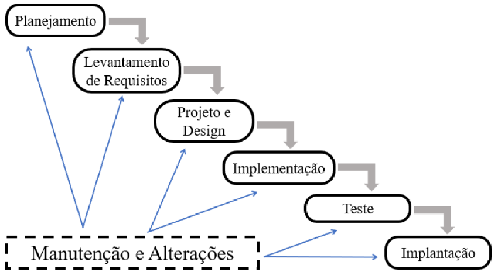
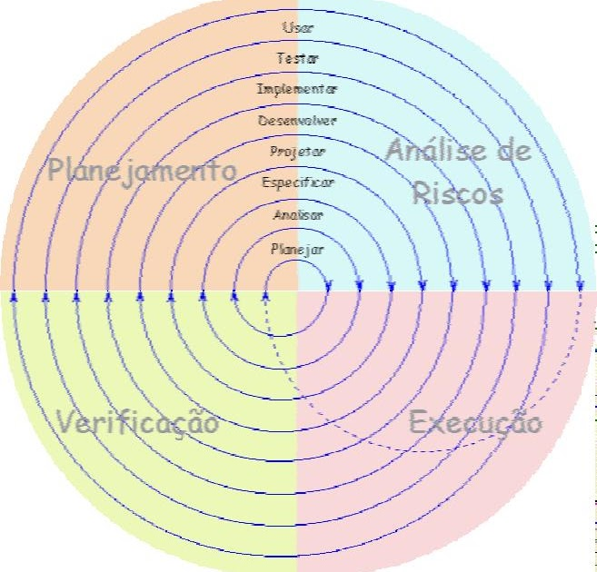
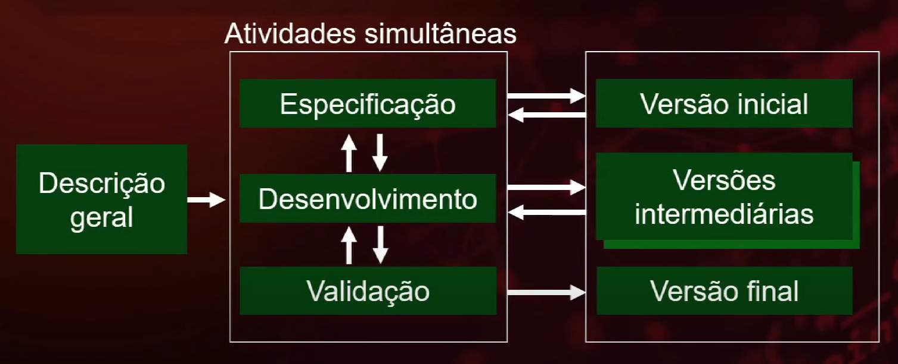
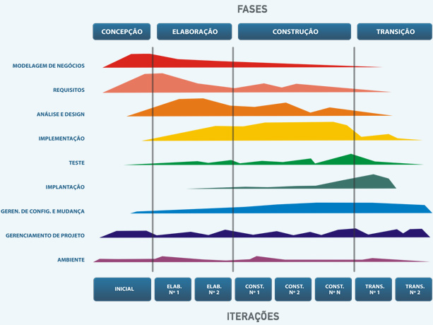
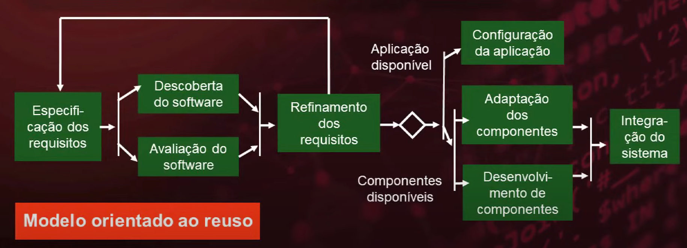

# engenharia-de-software
Engenharia de software é uma área interdisciplinar de conhecimento, que agrega ciências exatas e humanas, e.g., engenharia e administração.

### **MODELOS DE PROCESSO DE SOFTWARE**

> **CASCATA**
>>> Definição dos requisitos
>>>>> Projeto do Sitema e do Software
>>>>>>> Implementação e teste de unidade
>>>>>>>>> Integração e teste de sistema
>>>>>>>>>>> Operação e manutenção

 

> **MODELO DE BOEHM**
>> Planejar próxima fase
>
>> Desenvolver e verificar próximo nível do produto
>
>> Avaliar alternativas, Identificar, resolver riscos
>
>> Determinar objetivos, alternativas e restrições

 

> **MODELO INCREMENTAL**
>> DESCRIÇÂO GERAL
>>> Atividades simultâneas
>>>> Especificação
>>>>> Versão inicial
>>>
>>>> Desenvolvimento
>>>>> Versão intermediárias
>>>
>>>> Validação
>>>>> Versão final

 

> **MODELO IBM RATIONAL RUP**
>> FASES
>>> Iniciação
>>
>>> Elaboração
>>
>>> Construção
>>
>>> Transição

 

> **MODELO ORIENTADO AO REUSO**
>> Especificação dos requisitos
>>> Descoberta do software
>>
>>> Avaliação do software
>> Refinamento dos requisitos
>>>> Aplicação disponível
>>>>> Configuração da aplicação
>>>>
>>>>> Adaptação dos componentes
>>>>
>>>> Componentes disponíveis
>>>>> Desenvolvimento de componentes
>>>>>>> Integração do sistema

 

